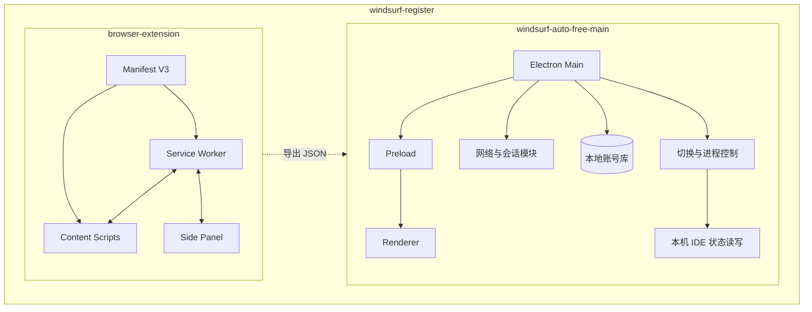
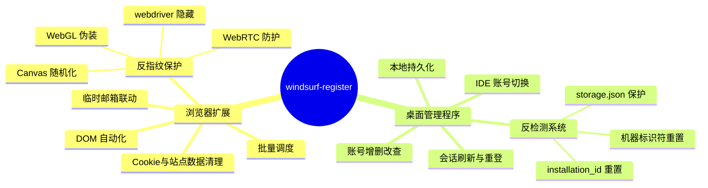
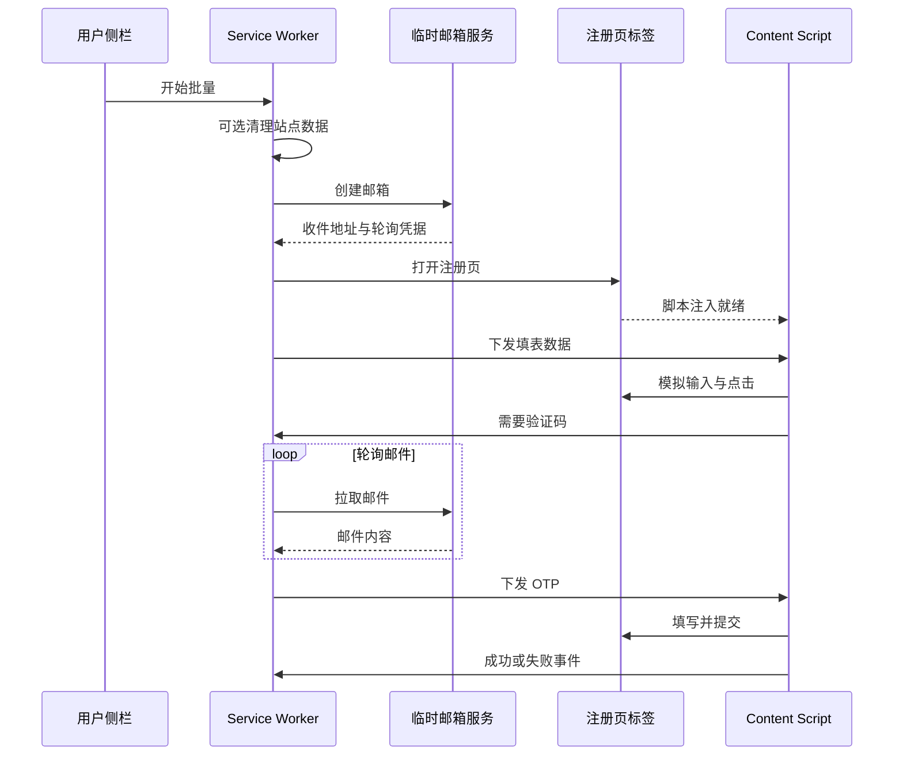
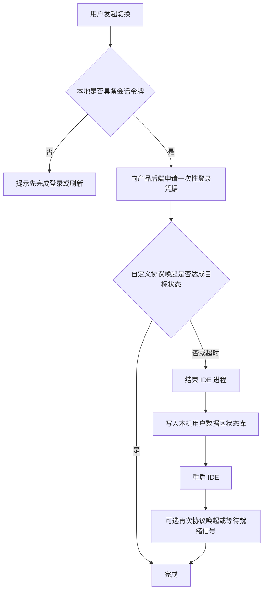

# windsurf-register


本仓库包含两个可配合使用的部分：**浏览器扩展（批量完成网站注册流程）**与 **桌面管理程序（本地账号库、会话刷新、IDE 切换）**。下文说明如何安装使用、如何按需配置、以及二者在实现上的底层逻辑（不涉及任何密钥、令牌或私密路径的罗列）。

---

## 开源治理与文档索引

| 文档 | 说明 |
|------|------|
| [TUTORIAL.md](TUTORIAL.md) | **分步教程**：扩展加载、桌面端启动、配置要点、推到 GitHub |
| [CONTRIBUTING.md](CONTRIBUTING.md) | 参与贡献、分支与提交约定、禁止向仓库提交敏感信息 |
| [CODE_OF_CONDUCT.md](CODE_OF_CONDUCT.md) | 社区参与者行为准则 |
| [SECURITY.md](SECURITY.md) | 安全漏洞与合规问题的反馈方式 |
| [CHANGELOG.md](CHANGELOG.md) | 版本与变更记录 |

GitHub 仓库可额外使用 `.github/ISSUE_TEMPLATE/` 与 `.github/PULL_REQUEST_TEMPLATE.md` 中的模板，便于 Issue / PR 信息完整。

---

## 研究与溯源声明（重要）

作者在研究与文档化过程中，曾使用 **IDA Pro**、**Ghidra**，以及适用于不同运行时与文件格式的 **常见反编译与静态分析工具**（例如面向托管程序、移动包、脚本资源等场景的工具链），并结合 **浏览器开发者工具** 对网络与存储行为进行观测。上述操作均限于 **本地环境、技术交流与互操作性分析**，目的在于理解客户端与服务器之间的协议形态及本地状态组织方式，**不构成、也不鼓励任何违法破解或盗版行为**。

- **本仓库不包含** 任何第三方商业软件的完整反编译源码树、破解补丁、注册机或用于绕过付费授权与法律保护机制的专用工具。公开内容为基于理解的 **独立参考实现**。  
- **禁止** 将本仓库用于：非法侵入他人系统、传播盗版、绕过依法对软件与数据的保护、或违反目标产品服务条款的用途。  
- 若您认为仓库内容涉及合法权益，请按 [SECURITY.md](SECURITY.md) 说明的方式联系处理。

---

## 架构与流程（图示）

以下 **Mermaid** 图示便于建立整体认知；与实现细节不一致时以源码为准。

### 单仓组件全景



### 能力范围思维导图



### 扩展：单条注册时序（简化）



### 桌面端：账号切换决策（简化）



---

## 一、仓库里有什么

| 目录 | 角色 |
|------|------|
| `browser-extension/` | 基于 Manifest V3 的 Chromium 扩展，在官方注册站点上辅助填表、收验证码、批量排队执行。 |
| `windsurf-auto-free-main/` | 基于 Electron 的 Windows 桌面程序，维护本地账号数据库，负责登录态刷新与在本机 Windsurf 客户端间切换账号。 |

运行桌面程序后，工作目录下可能生成 `data/` 等本地数据目录，**请勿将本地数据库或导出文件提交到公开仓库**。

---

## 二、使用教程（按顺序做即可）

### 2.1 浏览器扩展

1. **准备图标**  
   扩展清单中声明了多尺寸图标路径。请在该目录下放置对应 PNG，否则加载时可能提示资源缺失（不影响逻辑调试时可临时用占位图）。

2. **加载扩展**  
   打开 Chrome 或 Edge → `chrome://extensions` 或 `edge://extensions` → 开启「开发者模式」→「加载已解压的扩展程序」→ 选择本仓库中的 `browser-extension` 文件夹。

3. **打开侧栏**  
   点击工具栏上的扩展图标，按浏览器提示打开**侧边栏**（Side Panel）。主要操作都在侧栏内完成。

4. **开始批量流程**  
   - 在「数量」中填写本轮要执行的条数（上限以界面为准）。  
   - 点击「开始注册」。后台会按队列逐条执行：准备邮箱 → 打开注册页 → 注入页面的脚本自动填表 → 必要时等待邮件中的验证码并填入。  
   - 需要中止时点「停止」。

5. **查看结果与导出**  
   - 「实时日志」区域会滚动输出当前步骤说明。  
   - 「账号记录」中列出已成功写入本扩展存储的账号条目。  
   - 使用「导出 JSON」将记录下载到本机，供桌面程序导入（见下节）。

6. **常见现象**  
   - 若页面改版导致选择器不匹配，注入脚本可能停在某一步；以日志与页面实际文案为准排查。  
   - 若浏览器已登录同一产品账号，可能出现跳转个人页等情况，扩展会按逻辑中止当前条并继续或报错，具体以代码分支为准。

### 2.2 桌面管理程序（Electron）

1. **安装依赖**  
   在 `windsurf-auto-free-main` 目录打开终端，执行：

   ```bash
   npm install
   ```

2. **启动方式（二选一）**  
   - **普通启动**：`npm start`（或 `npx electron .`）。适合只做导入、刷新、查看，不做「切换 Windsurf 登录账号」。  
   - **管理员启动（推荐用于切换账号）**：运行同目录下的 `start.bat`。脚本会请求提升权限；切换流程需要结束本机 Windsurf 进程并写入其用户数据区域内的本地数据库，无管理员权限时容易失败。

3. **首次使用建议流程**  
   - 打开窗口后，确认界面展示的**网络/代理**提示是否符合本机环境（程序会读取系统代理相关设置做展示，具体逻辑见源码）。  
   - **添加账号**：在弹窗中输入邮箱与密码，程序会向身份服务与产品侧接口依次请求，把返回的会话信息写入本地库。  
   - **从扩展衔接**：使用扩展导出的 JSON，在管理台通过「从文件导入」或粘贴文本导入；格式为对象数组，字段为邮箱与密码（键名以程序解析逻辑为准，见源码中的导入处理）。  
   - **刷新**：单条「刷新数据」或「刷新全部」用于用已保存的刷新凭据更新令牌，或在缺少刷新凭据时用密码重新走完整登录链。  
   - **切换账号**：在列表中选择目标账号并执行切换；程序会尝试通过系统已注册的自定义协议唤起 Windsurf，失败时可能回退到「结束进程 + 直接改写本地状态 + 再启动」的路径（详见下文底层逻辑）。

4. **导出**  
   管理台可将当前库中账号导出为文本行（邮箱与密码分隔形式），便于备份；**导出的文件同样属于敏感信息，请妥善保管。**

---

## 三、配置教程（按需修改）

### 3.1 扩展侧

| 配置项 | 作用 | 如何改 |
|--------|------|--------|
| **临时邮箱服务** | 创建一次性收件地址、拉取邮件、解析验证码。 | 修改后台脚本中的 API 基地址与请求路径，并同步修改 `manifest.json` 里的 `host_permissions`，否则跨域请求会被浏览器拦截。 |
| **注册站点域名** | 内容脚本注入范围、打开的标签页 URL。 | 修改 `manifest.json` 中 `content_scripts.matches` 与后台里打开注册页的常量，保持与目标站点一致。 |
| **排除的邮箱域名** | 避免随机到不希望使用的临时域。 | 修改后台脚本中的排除规则列表。 |
| **批量节奏** | 每条之间的等待、是否清理站点数据等。 | 在后台调度函数中调整延时与是否调用 Cookie/站点数据清理 API（需具备对应 manifest 权限）。 |

**权限说明：** 扩展已声明 `storage`、`tabs`、`cookies`、`browsingData`、侧栏等权限；若你增加新的跨域 API，必须在 `host_permissions` 中声明目标源。

### 3.2 桌面程序侧

| 配置项 | 作用 | 如何改 |
|--------|------|--------|
| **身份与产品接口** | 登录、刷新、拉取用户资料等 HTTP 请求的端点与请求头策略。 | 在 `src/services` 下负责网络请求的模块中维护；若官方变更端点或客户端校验规则，需自行对照浏览器抓包更新（**勿将抓包得到的私密令牌写入仓库**）。 |
| **请求超时** | 避免网络或代理半开连接导致界面长时间无响应。 | 在同模块中调整超时常量；注意超时须覆盖「建立连接 + 读取完整响应体」。 |
| **本地库路径** | SQLite 文件落盘位置。 | 与进程当前工作目录相关；建议固定从某一启动方式进入，或将路径改为应用用户目录下的固定子路径（需改代码）。 |
| **Windsurf 可执行文件** | 切换完成后重新启动 IDE。 | 在切换相关模块中维护候选路径与注册表/环境探测逻辑；若安装路径非常规，可在该处增加你的安装目录。 |

**代理与网络：** 桌面程序内 HTTP 实现与系统/浏览器网络栈行为有关；若使用本地 HTTP 代理，请保证目标域名可走通，必要时为身份服务与产品域名配置直连规则（在代理软件侧配置，而非本 README 能穷举）。

---

## 四、底层逻辑（实现原理）

### 4.1 扩展：为什么能自动注册？

整体是 **Service Worker 调度 + 内容脚本操作 DOM + 跨上下文消息** 的经典结构。

1. **单次注册的流水线（后台）**  
   - 在内存中维护批量任务状态（总数、当前条、当前临时邮箱句柄、当前标签页 id、阶段等）。  
   - 每条开始前，可选地清理目标站在本浏览器中的 Cookie 与部分站点数据，降低「仍保持旧会话」对注册流的干扰。  
   - 通过 REST 在第三方临时邮箱服务上**创建邮箱**，得到用于后续轮询的令牌类字段。  
   - 用浏览器 API 打开官方注册页标签页，等待文档就绪后，向该标签页**发送一条带姓名/邮箱/密码的消息**。  
   - 内容脚本在页面内填表并点击下一步；当页面进入「等待邮箱验证码」阶段时，内容脚本向后台发消息；后台则**定时请求邮件列表**，从新邮件正文中用正则等方式取出数字验证码，再发回内容脚本填入。  
   - 检测到进入个人资料页或成功文案等条件时，记为成功并写入结果数组；失败则记录原因，关闭标签页，按延迟调度下一条。

2. **内容脚本如何驱动 React 类页面？**  
   许多现代站点用受控组件，直接改 `input.value` 不触发内部状态更新。实现上通过原生 `value` 描述符写入，并派发 `input` / `change` / `blur` 等事件，尽量让框架收到「用户输入」信号；按钮则通过文案模糊匹配点击。

3. **步骤识别**  
   通过 URL 片段与 `document.body` 内可见英文提示语，将当前页面归类为：注册页、密码页、OTP 页、个人页、未知。不同类别走不同分支（继续填表、要验证码、或判定失败）。

4. **与侧栏 UI 的通信**  
   后台用广播消息把状态推给侧栏；侧栏请求开始/停止、导出等再通过消息发给后台。扩展存储用于崩溃恢复时尽量接续状态（以代码为准）。

---

### 4.2 桌面程序：登录、刷新、切换分别做什么？

#### （1）登录与刷新（会话层）

目标是在本地库中保存**可被产品后端识别的访问凭据**以及用于续期的 **刷新凭据**（若接口返回）。

- **典型链路（概念）**  
  1. 使用「邮箱 + 密码」向通用的身份服务发起「密码登录」类请求，得到短期身份令牌与刷新凭据。  
  2. 再携带短期身份令牌，请求产品侧的「用身份令牌换取应用会话」类接口，得到应用侧 API 密钥或会话令牌、显示名等。  
  3. 将上述字段与过期时间写入本地 SQLite 表的一行中。

- **刷新**  
  - 若本地仍有有效的刷新凭据，则向身份服务的「刷新授权」端点用表单或 JSON 换取新的短期身份令牌，再更新库中字段。  
  - 若没有刷新凭据但仍有密码，则退化为再走一遍完整登录链（与「添加账号」相同）。  
  - 实现上应避免在同一次用户操作中，对「已经失败过的密码登录」无意义地立刻再调用一次，以免造成重复日志与重复请求（以当前主进程逻辑为准）。

- **网络实现要点**  
  请求需带与官方 Web 客户端相近的来源头信息，否则部分环境下身份接口会拒绝；超时需覆盖读完整响应体，避免在代理场景下「已收到头、体永不结束」导致假死。

#### （2）切换账号（与 Windsurf 本机进程交互）

目标是把 **当前库中选中账号所持有的会话令牌**，变成 **本机 Windsurf 进程正在使用的那一个**。

- **优先路径（协议唤起）**  
  1. 用库中已保存的会话类令牌，向产品后端请求「一次性登录用短令牌」（具体协议形态见源码：可能为二进制或 JSON 封装）。  
  2. 通过操作系统注册的应用协议链接，把短令牌作为参数唤起 Windsurf；由客户端完成登录态切换。

- **回退路径（直接改本地状态）**  
  当协议路径未在超时内观察到成功标志时：  
  1. 结束 Windsurf 相关进程（多种手段重试，直到确认退出）。  
  2. 在用户数据目录下的 **本地状态数据库**（基于 SQLite 的键值存储）中，按产品使用的键名写入选中账号的令牌、邮箱、安装标识等字段（键名与表结构以源码为准）。  
  3. 再次启动 Windsurf 可执行文件。  
  4. 可选地再次触发「刷新会话」类自定义协议，或再次换取一次性令牌并唤起，以促使客户端重读状态。  
  5. 通过轮询读取同一份状态文件或日志文件中的关键字，判断语言服务/登录态是否就绪。

- **为何常要求管理员**  
  结束进程、快速连续写文件、从非安装目录探测可执行路径等操作，在 Windows 上受权限与杀软策略影响较大；提升权限可减少「写不入、杀不净」导致的偶发失败。

#### （3）界面与数据

- 渲染进程通过 **预加载脚本暴露的受控 API** 调用主进程 IPC；主进程负责访问文件系统、发起网络、调用切换模块。  
- 控制台日志可从主进程转发到窗口，便于在同一界面查看。

---

## 五、反检测与反指纹（新增）

### 5.1 桌面端：机器标识符重置

2026年3月 Windsurf 实施配额制后，加强了多账号检测力度。项目新增 **anti-detect.js** 模块，在每次账号切换时自动重置以下标识符：

| 标识符 | 存储位置 | 格式 | 作用 |
|--------|---------|------|------|
| `telemetry.machineId` | `%APPDATA%\Windsurf\User\globalStorage\storage.json` | 64位十六进制 | 主要机器识别ID |
| `telemetry.macMachineId` | 同上 | 64位十六进制 | MAC地址衍生ID |
| `telemetry.devDeviceId` | 同上 | UUID | 设备标识符 |
| `telemetry.sqmId` | 同上 | `{大写UUID}` | 微软SQM兼容标识 |
| `installation_id` | `%USERPROFILE%\.codeium\windsurf\installation_id` | UUID | 安装标识 |

**自动触发时机：**
- 账号切换完成后（`switchAccountToDB()` 返回前）
- 重置结果会写入切换返回值，便于 UI 层展示

**手动触发：**
- IPC 接口：`antidetect:reset`（可通过 UI 按钮调用）
- 状态检查：`antidetect:checkStatus`（检查文件是否存在）

### 5.2 浏览器扩展：反指纹保护

扩展在 `document_start` 阶段向所有 `windsurf.com` 页面注入 `antifingerprint.js`，提供以下保护：

| 保护项 | 原理 | 效果 |
|--------|------|------|
| `navigator.webdriver` 隐藏 | 重写属性描述符 | 消除自动化工具标志 |
| Canvas 指纹随机化 | 向 `toDataURL()` 注入微小噪声 | 每次访问产生不同指纹 |
| WebGL 渲染器伪装 | 拦截 `getParameter()` 返回随机显卡型号 | 模拟不同硬件环境 |
| WebRTC 本地 IP 保护 | 封装 `RTCPeerConnection` | 防止真实 IP 泄漏 |
| AudioContext 干扰 | 在创建压缩机时注入噪声 | 干扰音频指纹检测 |
| 密码生成加密安全 | 使用 `crypto.getRandomValues()` | 消除 `Math.random()` 的可预测性 |

**重要说明：**
- 反指纹脚本在所有 `windsurf.com` 页面加载时自动激活
- 无需用户手动操作，扩展加载即生效
- 不影响注册流程的正常使用

### 5.3 检测维度对照

Windsurf 当前（2026年）的检测维度包括：

1. **设备指纹**：`machineId` + `macMachineId` + `devDeviceId` → **已覆盖**
2. **安装标识**：`installation_id` → **已覆盖**
3. **浏览器指纹**：Canvas + WebGL + webdriver 标志 → **已覆盖**
4. **网络关联**：IP + 代理线路 → **需用户自行配置代理**
5. **行为关联**：操作节奏、使用模式 → **部分覆盖（扩展注册有随机延时）**

---

## 六、两个部分如何衔接（数据层面）

扩展导出的 JSON 为**对象数组**，每个对象至少包含**邮箱**与**密码**字段（键名与解析兼容别名见桌面程序导入逻辑）。桌面程序导入时会逐条尝试走登录链，将成功或失败状态写回本地库。

---

## 七、合规与免责

除上文 **「研究与溯源声明」** 外，请自行遵守目标产品、身份服务、临时邮箱服务及所在地的法律与条款。本仓库按「原样」提供，**不保证可用性、不保证与任何第三方服务长期兼容**。因使用本仓库导致的账号限制、封禁或数据问题，**须由使用者自行承担**。

---

## 八、许可证与工程规范

发布到公开平台前，请在本仓库根目录自行添加 `LICENSE`（SPDX 标识建议写入 README 徽章与 `package.json` 等元数据）。请勿将个人账号、密钥、本地数据库或抓包导出纳入版本控制；建议配合 `.gitignore` 与 CI 秘密扫描使用。

本仓库配套 **CONTRIBUTING / CODE_OF_CONDUCT / SECURITY / CHANGELOG**（见文首索引），以符合常见开源项目的治理与协作习惯。
